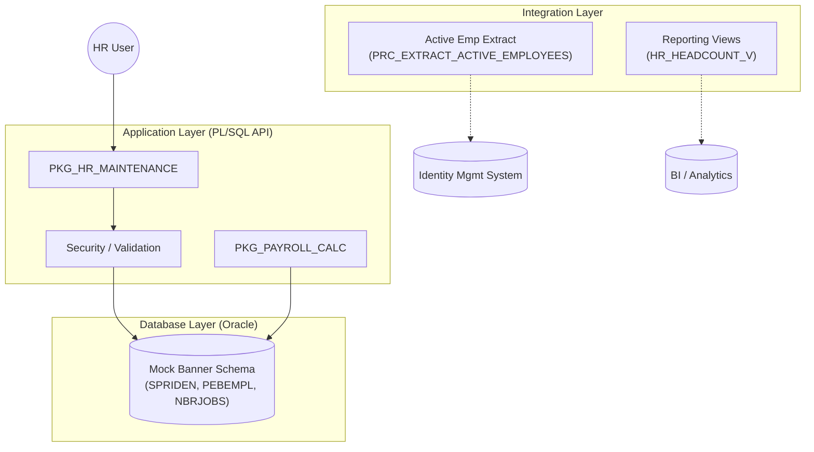

# University HR Payroll Demo System

## Overview
This project illustrates a backend solution for a University Human Resources and Payroll system, designed to mimic the architectural principles of **Ellucian Banner**. It utilizes **Oracle PL/SQL** for core business logic, data integrity, and enterprise integrations.

## System Architecture



## Project Directory Structure

```
university-hr-payroll-demo/
├── database/
│   ├── ddl/               # Schema definitions (Tables, Constraints)
│   └── packages/          # PL/SQL Business Logic (Specifications & Bodies)
├── integrations/          # Data extraction and interface scripts
├── reporting/             
│   └── views/             # Analytical views for HR/Payroll
└──demo_runner.sql         # End-to-End Demo Simulation Script
```

## Getting Started

### Prerequisites
- Oracle Database (11g, 12c, 19c, or 21c)
- SQL Client (SQL*Plus, SQL Developer, or VS Code with Oracle Ext)

### Installation
1.  **Clone** this repository.
2.  **Connect** to your Oracle instance.
3.  **Run** the setup scripts in order:
    1.  `database/ddl/01_mock_banner_schema.sql`
    2.  `database/packages/pkg_hr_maintenance.sql`
    3.  `database/packages/pkg_payroll_calc.sql`
    4.  `integrations/prc_extract_active_employees.sql`
    5.  `reporting/views/hr_reporting_views.sql`

### Running the Demo
Execute the `demo_runner.sql` script to see the system in action:
```sql
@demo_runner.sql
```
This will:
- Hire a new employee ("John Doe")
- Assign a Faculty position
- Run the monthly payroll
- Extract functionality for integrations
- Display key reports

## Web Application Demo (Python/Flask)

For a visual demonstration of the system capabilities to business users (HR/Payroll Dept), a Web Interface is available.

### Prerequisites (Web App)
- Python 3.8+
- Flask (`pip install flask`)

### Running the Web App
1.  Navigate to the project root.
2.  Install dependencies (if not done):
    ```bash
    pip install flask
    ```
3.  Start the Application:
    ```bash
    python app/app.py
    ```
4.  Open your browser to: `http://localhost:5000`

### Web Features
- **Dashboard**: High-level view of system status.
- **New Hire Portal**: Graphical form to input `SPRIDEN` and `PEBEMPL` data.
- **Payroll Runner**: "One-click" execution of the payroll batch process.
- **Analytics**: Visualization of Headcount data.

## License
MIT License - Educational Demo
