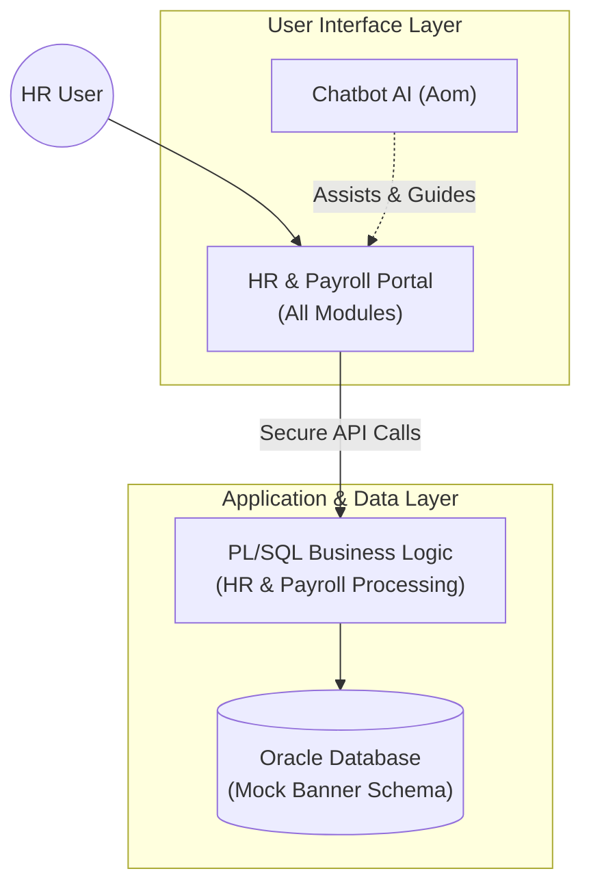

# University HR Payroll Demo System

## Overview
This project illustrates a backend solution for a University Human Resources and Payroll system, designed to mimic the architectural principles of **Ellucian Banner**. It utilizes **Oracle PL/SQL** for core business logic, data integrity, and enterprise integrations.

## System Architecture



## Project Directory Structure

```
university-hr-payroll-demo/
├── app/
│   ├── static/            # CSS, JS, and UI Assets
│   ├── templates/         # HTML Templates
│   │   └── chatbot_widget.html # 🔥 Reusable AI Assistant Component
│   └── app.py             # Flask Backend/Controller
├── database/
│   ├── ddl/               # Schema definitions (Tables, Constraints)
│   └── packages/          # PL/SQL Business Logic
├── integrations/          # External Interface Scripts
├── reporting/             # Analytical Views
└── README_DEPLOY.md       # Cloud Deployment Guide
```

## Getting Started

### Prerequisites
- Oracle Database (11g, 12c, 19c, or 21c)
- SQL Client (SQL*Plus, SQL Developer, or VS Code with Oracle Ext)

### Installation
1.  **Clone** this repository.
2.  **Connect** to your Oracle instance.
3.  **Run** the setup scripts in order:
    1.  `database/ddl/01_mock_banner_schema.sql`
    2.  `database/packages/pkg_hr_maintenance.sql`
    3.  `database/packages/pkg_payroll_calc.sql`
    4.  `integrations/prc_extract_active_employees.sql`
    5.  `reporting/views/hr_reporting_views.sql`

### Running the Demo
Execute the `demo_runner.sql` script to see the system in action:
```sql
@demo_runner.sql
```
This will:
- Hire a new employee ("John Doe")
- Assign a Faculty position
- Run the monthly payroll
- Extract functionality for integrations
- Display key reports

## Web Application Demo (Python/Flask)

For a visual demonstration of the system capabilities to business users (HR/Payroll Dept), a Web Interface is available.

### Prerequisites (Web App)
- Python 3.8+
- Flask (`pip install flask`)

### Running the Web App
1.  Navigate to the project root.
2.  Install dependencies (if not done):
    ```bash
    pip install flask
    ```
3.  Start the Application:
    ```bash
    python app/app.py
    ```
4.  Open your browser to: `http://localhost:5000`

### Web Features
- **Interactive Dashboard**: A real-time command center providing high-level situational awareness:
    - **Visual Analytics**: Interactive charts (powered by Chart.js) showing Headcount by Department, Workforce Type, and Salary Distribution.
    - **Live KPIs**: Instant totals for active headcount, estimated annual payroll expense, and key upcoming dates.
- **New Hire Portal**: Graphical form to input `SPRIDEN` (Identity) and `PEBEMPL` (Employment) data directly into the mock-Banner ecosystem.
- **Payroll Runner**: "One-click" execution of the `PKG_PAYROLL_CALC` batch process, simulating enterprise-grade financial calculations.
- **Employee Management**: An administrative directory for personnel oversight:
    - **Advanced Search**: Real-time filtering by name, ID, or department.
    - **Dynamic Actions**: Ability to update employee profiles (Job Title, Salary, Classification) via a secure interface.
    - **Status Tracking**: Visual indicators for employment status (Active, Leave, Terminated).
- **Service Portal**: A centralized hub for administrative and technical support:
    - **Request Routing**: Categorized intake for IT tickets, report requests, and staff feedback.
    - **Priority Management**: Integrated urgency scaling (Urgent to Low) for workload prioritization.
    - **Asset Linkage**: Support for file attachments to streamline issue resolution.
- **System Audit Log**: Enhanced oversight for security and compliance:
    - **Activity Tracking**: Comprehensive logging of administrative actions and system events.
    - **Security Forensics**: Capture of metadata including performer ID, IP addresses, and detailed action descriptions.
    - **Entity Context**: Direct linkage between audit events and specific employee records (PIDMs).
- **Virtual Assistant (Aom)**: AI-powered chatbot widget providing contextual help, credentials guidance, and interactive demo boundaries.
- **Enterprise Login Portal**: A secure, Banner-themed authentication entry point:
    - **Multi-Step Verification**: Integrated 2FA system simulating enterprise identity management.
    - **Demo Optimization**: Streamlined authentication flow with pre-filled verification fields for frictionless presentation.
    - **Assisted Onboarding**: Contextual guidance from the Virtual Assistant (Aom) to ensure immediate access during demo sessions.

### Virtual Assistant (Aom) Technical Specs
The chatbot is designed as a modular **JS/HTML Widget**:
- **Persistence**: Reusable component via ``.
- **Interactive Triggers**: Programmatically controlled via `addBotMessage()`, allowing system events (like clicking a disabled button) to trigger natural language responses.
- **Zero-Backend Dependency**: Currently runs on client-side logic for demo speed, with easy hooks for LLM/OpenAI integration.

### Demo Notes
- **Process Restrictions**: Buttons like "Process New Hire" and "Submit Request" are restricted in the demo environment to preserve system integrity. Interactions with these elements trigger a notification from Aom.
- **Auto-Assistant**: The virtual assistant "Aom" automatically opens on the login page to assist with the initial sign-in process.

## License
MIT License - Educational Demo
